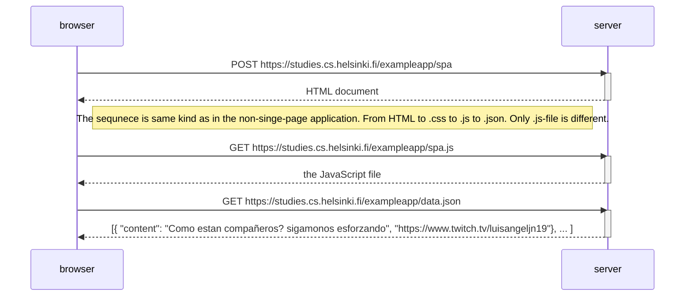

```mermaid
sequenceDiagram
    participant browser
    participant server

    browser->>server: POST https://studies.cs.helsinki.fi/exampleapp/spa
    activate server
    server-->>browser: HTML document
    deactivate server
    
    Note right of browser: The sequnece is same kind as in the non-singe-page application. From HTML to .css to .js to .json. Only .js-file is different. 
    

    
    browser->>server: GET https://studies.cs.helsinki.fi/exampleapp/spa.js
    activate server
    server-->>browser: the JavaScript file
    deactivate server
  
    browser->>server: GET https://studies.cs.helsinki.fi/exampleapp/data.json
    activate server
    server-->>browser: [{ "content": "Como estan compañeros? sigamonos esforzando", "https://www.twitch.tv/luisangeljn19"}, ... ]
    deactivate server
```
